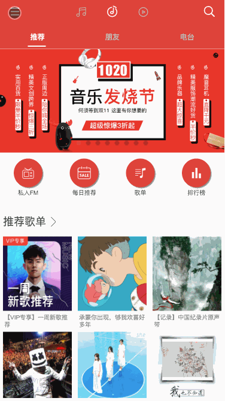

# 网易云音乐 Vue-music

> 用`vue`做的一款模仿`网易云app`的 webapp，在 pc 端浏览此项目，需切换到手机预览模式，目前实现的功能有`手机号登录`、`歌手列表`、`歌曲查询`、`歌曲播放`等功能。

项目预览地址:[vue-music](http://132.232.73.32:3001)

音乐接口用的开源项目:[NeteaseCloudMusicApi/](https://binaryify.github.io/NeteaseCloudMusicApi/#/)




## clone

`git clone git@github.com:GongJS/vue-music.git` // 前端代码

`git clone git@github.com:Binaryify/NeteaseCloudMusicApi.git` // 服务端代码

## 安装

`cd vue-music` && `cd NeteaseCloudMusicApi`

`npm install` or `yarn`

## 启动服务

`npm run dev` // 启动前端服务 在 vue-music 根目录下执行
`node app.js` // 启动后端服务 在 NeteaseCloudMusicApi 根目录下执行 默认 3000 端口

## 解决跨越问题

前后端两套代码存在跨越问题，需修改`vue-music`目录下的`config/index.js`文件，在 dev 里添加如下代码：

```
proxyTable: {
  '/': {
    target: 'http://localhost:3000',
    changeOrigin: true
  }
```

否则无法正确获取到数据。

## 寻找小伙伴

这个项目对比网易云 app 还有好多功能没有实现，由于本人时间有限，所以更新的速度比较慢，如果有对此项目感兴趣的小伙伴，欢迎 fork，或者联系本人加到项目组里一起开发。

## License

[MIT](http://opensource.org/licenses/MIT)

Copyright (c) 2018 GongJS
